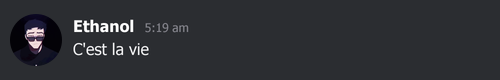

# Drop The Cap

A library for creating fake Discord screenshots.

## Features

- **Fake messages**: Create realistic message layouts similiar to Discord's UI.
- **Customizable details**: Set username, avatar, timestamp, and message content.
- **Avatar generation**: Load avatars from URLs or local files, with automatic circular cropping.
- **Custom colors**: Customize background, username, timestamp, and message text colors.
- **Random timestamp**: Automatically generates random timestamps if not provided.

## Example



## Installation

You can install this package via npm:

```bash
npm install drop-the-cap
```

Or if you're using yarn:

```bash
yarn add drop-the-cap
```

## Usage

You can generate a fake Discord screenshot using the `generateDiscordMessage` function.

### Example

```js
const { generateDiscordMessage } = require("drop-the-cap");

generateDiscordMessage({
    pfpPath:
        "https://cdn.discordapp.com/avatars/418364415856082954/2ed8a299c01845920efc7cbab2a015eb.webp?size=2048",
    outputPath: "discord_message.png",
    username: "kokos.e.",
    timestamp: "7:38 pm",
    message: "Blackpink sucks ngl",
    backgroundColor: "#2b2d31",
    usernameColor: "white",
    timestampColor: "#b5bac1",
    messageColor: "#dbdee1",
});
```

### Parameters

**Note:** All the parameters are optional.
| Parameter | Type | Description | Default |
|------------------|--------|-----------------------------------------------------------------------------|-----------------------------|
| `pfpPath` | String | URL or file path of the user's profile picture. | Test image URL |
| `outputPath` | String | Path where the generated screenshot is saved. | `fake_discord_message.png` |
| `username` | String | Username to display. | Ethanol |
| `timestamp` | String | Message timestamp. If not provided, a random one is generated. | Random timestamp |
| `message` | String | The message's content. | C'est la vie |
| `backgroundColor`| String | Background color of the screenshot. | `#2b2d31` |
| `usernameColor` | String | Color of the username. | `white` |
| `timestampColor` | String | Color of the timestamp. | `#83838b` |
| `messageColor` | String | Color of the message text. | `#efeff0` |
| `timestampXOffset`| Number| Horizontal offset for the timestamp (sometimes the alignment is off). | `35` |

## License

This project is licensed under the MIT License - see the [LICENSE](LICENSE) file for details.
