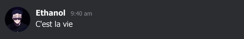

# Drop The Cap

**Generate fake Discord message screenshots with avatars.** 💻🎨

## Features ✨

- **Generate fake Discord messages**: Create realistic message layouts like Discord's UI. 💬💻
- **Customizable user details**: Set username, timestamp, and message content. ✏️👤
- **Avatar generation**: Load avatars from URLs or local files, with circular cropping. 🖼️
- **Custom colors**: Customize background, username, timestamp, and message text colors. 🎨🖌️
- **Random timestamp generation**: Automatically generate random timestamps for messages. ⏰🔄

## Sample



## Installation 🛠️

You can install this package via npm:

```bash
npm install drop-the-cap
```

Or if you're using `yarn`:

```bash
yarn add drop-the-cap
```

## Usage 📲

You can generate a Discord-style message screenshot by using the `generateDiscordMessage` function.

### Example 📝

```js
const { generateDiscordMessage } = require("drop-the-cap");

generateDiscordMessage({
  pfpPath:
    "https://cdn.discordapp.com/avatars/418364415856082954/2ed8a299c01845920efc7cbab2a015eb.webp?size=2048",
  outputPath: "discord_message.png",
  username: "kokos.e.",
  timestamp: "7:38 pm",
  message: "Blackpink sucks ngl",
  backgroundColor: "#2b2d31",
  usernameColor: "white",
  timestampColor: "#b5bac1",
  messageColor: "#dbdee1",
});
```

### Parameters 📋

**Note:** All the parameters are optional.
| Parameter | Type | Description | Default |
| ------------------ | ------ | --------------------------------------------------------------------------- | -------------------------- |
| `pfpPath` | String | 🖼️ URL or file path of the user's profile picture. | Sample image URL |
| `outputPath` | String | 📂 Path where the generated screenshot will be saved. | `fake_discord_message.png` |
| `username` | String | 🧑‍💻 Username to display. | `"Ethanol"` |
| `timestamp` | String | ⏳ Message timestamp. If not provided, a random one is generated. | Random timestamp |
| `message` | String | 💌 The message content. | `"C'est la vie"` |
| `backgroundColor` | String | 🎨 Background color of the message box. | `#2b2d31` |
| `usernameColor` | String | 🖋️ Color of the username text. | `white` |
| `timestampColor` | String | ⏱️ Color of the timestamp text. | `#83838b` |
| `messageColor` | String | 📝 Color of the message text. | `#efeff0` |
| `timestampXOffset` | Number | ➡️ Horizontal offset for the timestamp (helps align with longer usernames). | `35` |

## License 📝

This project is licensed under the MIT License - see the [LICENSE](LICENSE) file for details.
